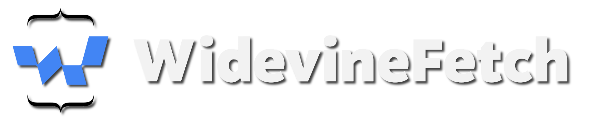

## How does it work?
Parses 'Copy as fetch' of a license request, locates the challenge if license wrapping is being used, extracts the PSSH data and re-sends the request. No Manifest, Cookies or License wrapping integration required. 

## Requirements
+ [L3 CDM](https://forum.videohelp.com/threads/408031-Dumping-Your-own-L3-CDM-with-Android-Studio)
+ [Python 3.12](https://www.python.org/)

## Installation
+ Place your CDM (as a Widevine Device) inside of the `cdm` folder.
+ Install the `requirements.txt` file

## Usage
1. Play a DRM protected video
2. Click `Copy -> Copy as fetch` on **the second license URL (the one with the long payload)**
3. Click `Process`

## Demo
> [!NOTE]  
> This video is somewhat outdated, as you don't have to paste the string anymore. It'll be retrieved from your clipboard automatically.

[demo.webm](https://github.com/user-attachments/assets/fc3be401-0bf5-46b3-a051-6194bcbe97e9)
